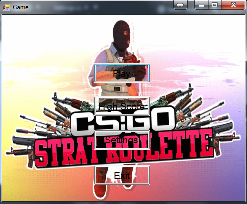
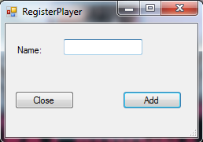
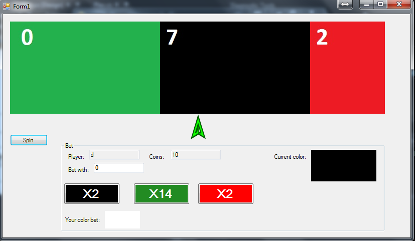
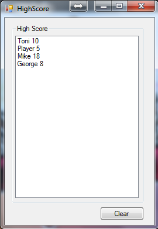
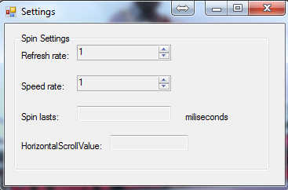

@@ -0,0 +1,86 @@
 +# GameRoulette
 +
 +
 +<h2>Опис на Играта</h2>
 +

 +Играта што ја направивме е имплементација на игра  CS:GO Roulette која овозможува купување на дополнителни работи за познатата игра CS:GO .
 +Оваа игра претставува типична рулет игра каде корисникот може да се обложи на некој од трите бои и во зависност од бојата и вложената сума да добие пари.
 +
 +• Кога корисникот ќе притисне Play
 +
 +На почетокот при самото стартување на играта корисникот има 10 парички и може да се обложи со максимум 10 односно со сите  пари што ги има на располаѓање при првото вртење, корисникот потоа може да избере помеѓу трите бои кои  претставуваат за колку %(проценти) ќе се зголеми вложената сума на парички и да притисне на копчето спин, каде што лентата со трите бои ќе започне да се врти,
 +при што за рандом време ќе застане.Корисникот добива x2 ако стрелката застане на црвена или црна боја,а притоа се обложил на една од овие две бои и истата ја погодил
 +и x14 ако стрелката застане на зеленото поле.Корисникот на овој начин освојува пари но,
 +доколку ги изгуби сите пари се појавува соодветна анимација која го репрезентира губењето на сите пари.
 +
 +• Кога корисникот ќе притисне High Score
 + 
 +На играта е достапно и следење на сите играчи и нивните освоени пари.
 +
 +• Кога корисникот ќе притисне Settings
 + 
 +Тука е достапно информации за колку време трае едно вртење и со која брзина се врти.
 +
 +• Кога корисникот ќе притисне Exit
 + 
 +Играта се исклучува.
 +
 +

 +
 +
 +
 +<h2>Опис на решението</h2>
 +

 +Оваа игра содржи 6 форми и 2 класи.
 + 
 +<b>Првата</b> форма се вика Game и пресставува главна форма преку која се отвараат другите форми. <b> Втората</b> форма Play ги содржи елементите со кои играчот стапува во интеракција.  Во оваа форма е прикажан рулетот, копчето за спин и опциите за обложување.  Опциите за обложување се состојат од приказ на името на играчот, неговите моментални пари, поле за внес на износ со кои играчот се обложува, приказ на моменталната боја кон која покажува стрелката, 3 копчиња за обложување на боја и приказ на која боја се обложил играчот при што е дозволено оваа боја да се менува пред  да почне да се врти рулетот.
 + <b>Третата</b> форма High Score се користи за да се прикажат сите играчи и нивните освоени пари.
 + <b>Во четвртата</b> форма Settings е прикажано колку време трае еден спин и со која брзина се врти рулетот.  Овие вредности се доделуваат на рандом начин.
 + <b>Петтата</b> форма RegisterPlayer се отвара при клик на копчето Play во формата Game и служи за да играчот го внесе своето име.
 + <b>Шестата</b> форма LoserWinner содржи одредена анимација која во зависност од одреден настан се прикажува.  Постојат два настани кои ја отвараат оваа форма.  Првиот настан е кога играчот ќе ги изгуби сите пари и нема да има повеќе пари за обложување.  Во овој случај формата се отвара со анимација за Game Over.  Вториот настан е кога играчот ќе се обложи на зелената боја и по спинот стрелката покажува кон истата боја.  Во овој случај формата се отвара со анимација за голема добивка. 
 + 
 +<b>Класата</b> ListOfPlayers чува листа на објекти од класата Player, а <b>класата</b> Player чува име на играчот и колку пари има тој играч.
 +
 +
 +

 +
 +
 +<h2>Опис на функцијата readColor()
 +</h2>
 +
Функцијата  readColor() во класата Play е потребна за да се прикажува бојата кон која покажува стрелката во секој момент од отварање на формата Play и да се прочита истата со цел подоцна да се провери дали играчот се обложил на неа и дали по спинот стрелката покажува кон таа боја.
 +Бидејќи е потребно во секој момент играчот да знае која боја е покажувана од стрелката оваа функција се повикува секоја милисекунда. Овие функционалности се извршуваат доколку формата е активна. Прво се иницијализира битмапа со големина од панелот на формата. Панелот на формата содржи PictureBox кој го прикажува рулетот. 
 +Откако ќе се иницијализира битмапата на нејзе се исцртува слика од моменталната состојба на рулетот односно се исцртува целиот панел. Потоа се пресметуваат вредности за x и y односно вредности за координатната точка која се наоѓа во центарот на панелот односно битмапата по x и y оската. 
 +Откако го имаме центарот на панелот односно битмапата ја читаме бојата на точката  во центарот. Со истата таа прочитана боја го боиме панелот за приказ на моменталната боја кон која покажува стрелката и ја иницијализираме глобалната променлива curColor која се користи понатака за да се провери по спинот на која боја покажува стрелката и дали таа боја ја одбрал играчот кога се обложил.  
 +
 +

 +
 +<h2>Screenshoots од изгледот на играта и кратко упатство како се игра</h2>
 +

 +Кога ќе се стартува играта корисникот има можност за преглед на сите функционалности кој оваа апликација ги нуди.
 +
 +

 +
 +
 +
 +Кога ќе се притисне на Play корисникот мора да го внесе неговото име. 
 +
 +
 +
 +
 +
 +Со притискање на Add се зачувува неговото име во High Score и корисникот преминува на следната форма односно на суштината на оваа апликација
 +Корисникот најпрво треба да внесе сума на пари кој сака да ги обложи,потоа да одбере една од трите понудено бои па да притисне на копчето spin.
 +Ако бојата што ја одбрал застане на зелената стрелка тогаш неговата сума се множи со горенаведената ознака.
 +
 +
 +
 +Во High Score може да се преглеедаат сите имиња на  кориснииците заедно со нивните пари. 
 +
 +
 +
 +Во Settings има преглед на прилагодувањата на спинот.
